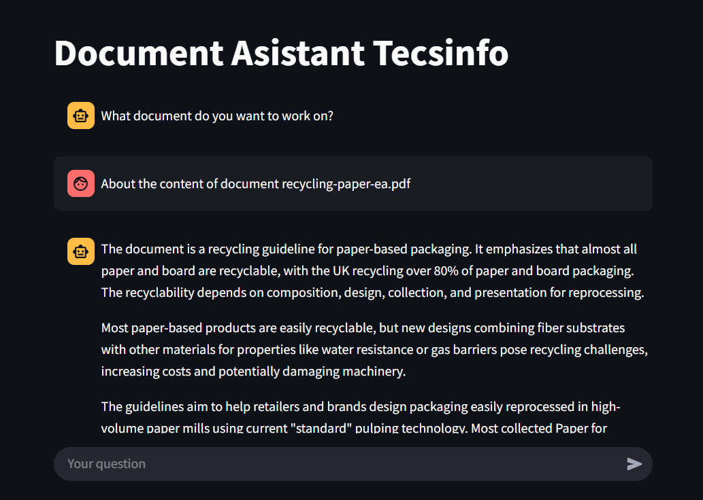
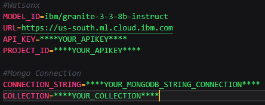

# 💫 Document Analyst Assistant:

Source code of the Document Analysis Agent prototype developed by the TECSINFO team.



## 🌐 Configure .env file:

Configure the .env file with your IBM Watsonx credentials. Follow the example provided in the .env.example file.



# 💻 Execute:

Install the required libraries

To run the backend, execute the following command in the hackatonapi directory:
```
fastapi run main.py
```

To run the Angular frontend (Node is required), execute the following commands in the hackaton_front directory:
```
npm install
npm start
```

To run the Streamlit frontend (Streamlit is required), execute the following command in the hackatonapi/front directory:
```
streamlit run interface.py
```
